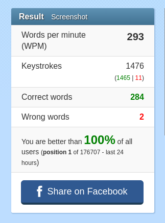

Auto-Type
==========

Auto-Type is a program that echo's input from stdin as user input through the uinput virtual device. It is comprised of two parts. First, the virtual driver cinput allows for events to be written to the uinput device. Auto-type is a layer built on top of cinput that will read in a file and echo the input as events.

Eventually mouse events will be added to cinput  

Usage
--------------
Compile: make auto_type
Usage: cat text_to_type | sudo ./auto_type  
  
Note: Must run as sudo or the program will not work

What Can I Do With This?  
---------------------------  

Cheat at typing tests of course  
	
	
(The missed words are because I didn't enable the ' key, so "don't" and "isn't" were incorrect)
	
Portability Issues 
--------------------------  

I have only tested this on Ubuntu, because the actual device is saved under different names on different distributions, which means this isn't very portable.  

Why?  
----------------------------  

After spending a week manually filling in AODA Compliance reports, I wanted to find a way to take the headache out of going to each webpage, copying the URL to the report, then typing in a "short name". Since all the sites are Drupal, I could easily query the database to get all the webpage aliases and titles and put these into a file. From there, auto-type could easily put this information into the report.    

Did this save me any time? Probably not, however it was an interesting experience to learn about the kernal's input subsystem.  

Resources:  
=======================  
-http://thiemonge.org/getting-started-with-uinput
